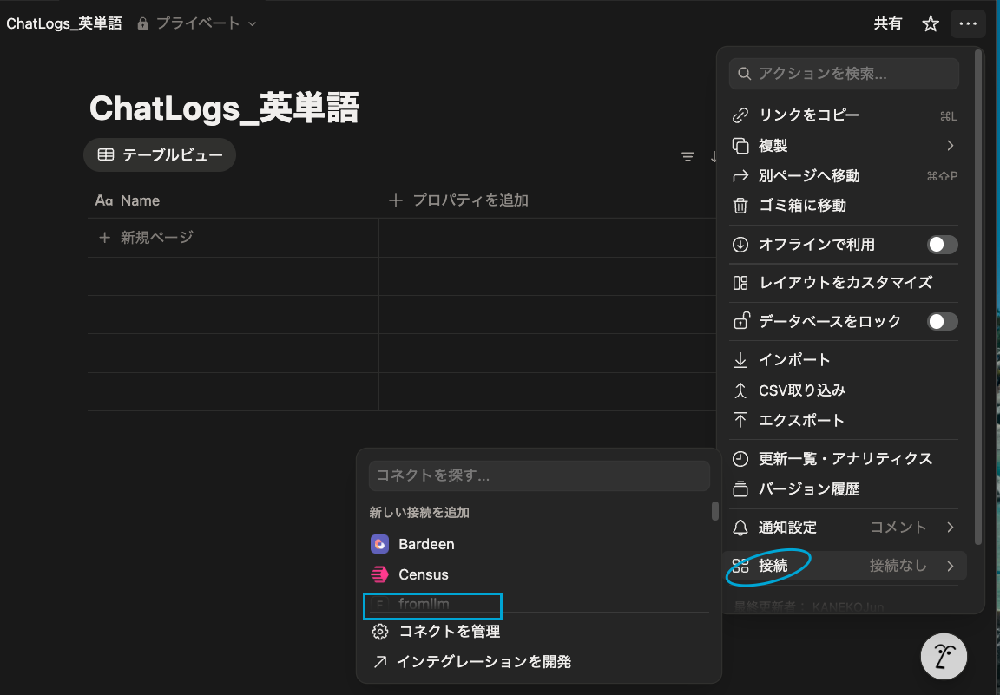

# LLM Chat App with Multi-Model Support and Notion Integration

[](https://github.com/Jun-kaneko/SelectLLM_Dic_Notion/stargazers)
[](https://github.com/Jun-kaneko/SelectLLM_Dic_Notion/network/members)
[](https://opensource.org/licenses/MIT)

## 概要 (Overview)

このアプリケーションは、[Gradio](https://www.gradio.app/) を利用したシンプルなWeb UIを通じて、複数の大規模言語モデル（LLM）と対話できるチャットツールです。
さらに、チャット履歴を [Notion](https://www.notion.so/) データベースに保存する機能も備わっています。

### 主な機能

*   **複数LLMのサポート**: OpenAI (GPT-4o-mini), Anthropic (Claude-3-Haiku), Google (Gemini-2.5-Flash), DeepSeek (deepseek-chat) を利用できます。
*   **質問タイプの選択**: 「通常の質問」と「英単語の質問」を切り替え可能。英単語の質問時には、英語学習者向けに最適化されたシステムプロンプトが適用されます。
*   **システムプロンプトのカスタマイズ**: 通常の質問の場合、ユーザーがシステムプロンプトを自由に設定できます。
*   **Notion連携**: チャット履歴をNotionの指定されたデータベースに保存できます。質問タイプによって異なるデータベースに保存することも可能です。
*   **ストリーミング応答**: LLMからの応答がリアルタイムで表示されます。

## スクリーンショット (Screenshots)



## 動作環境 (Requirements)

*   Python 3.9+
*   以下のAPIキー
    *   OpenAI API Key (GPT用)
    *   Anthropic API Key (Claude用)
    *   Google API Key (Gemini用)
    *   DeepSeek API Key (DeepSeek用)
    *   Notion API Key (Notion連携用)
*   NotionデータベースID (Notion連携用)

## セットアップ (Setup)

### 1. リポジトリのクローン

```bash
git clone https://github.com/Jun-kaneko/SelectLLM_Dic_Notion.git
cd SelectLLM_Dic_Notion
